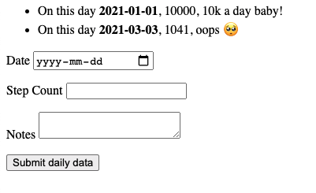

# 🌸 Mirth

Mirth is a bare-bones Ruby web application created for educational purposes. 

It utilizes several Ruby on Rails libraries, such as Action Controller, Action Dispatch and Active Record. 

# 👩🏻‍💻 Installation

1. Create a `sqlite3` database table:

```
sqlite3 mirth.sqlite3
CREATE TABLE daily_data (date TEXT, step_count INT, notes TEXT);
.quit
```

(if only we had a job for this)

2. Run `ruby mirth.rb` 

# 👀 It works


